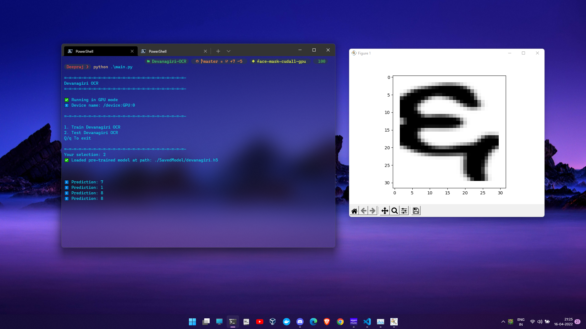

# Devanagiri-OCR

## Introduction
A Devanagiri Digits Classifier trained using Kaggle Dataset with a basic Convolutional Neural Network architecture

## Setup Python environment (using conda)

- Install [miniconda3](https://repo.anaconda.com/miniconda/)

- Setup environment:

        conda create -n "devanagiri-ocr" python=3.8.13

        conda activate "devanagiri-ocr"

        conda install cuduatoolkit=11.3                         # Required for Cuda GPU Rendering

        conda install cudnn                                     # Required for Cuda GPU Rendering

        pip install -r requirements.txt

## Run Script
- Run the main.py after activating the conda environment

        python main.py
